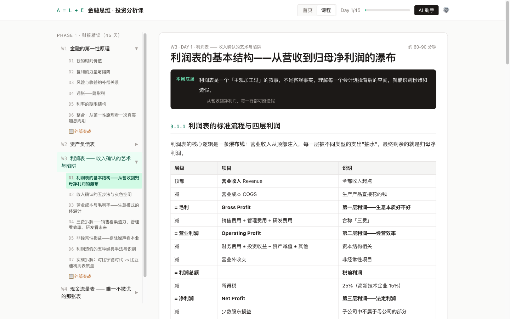

<div align="center">

# invest-101

**6 周 · 30 天 · 把财报和估值读成一套能上手的判断框架**

[在线课程](https://laxlyezhi.github.io/invest-101/) · [课程大纲](#课程大纲) · [快速开始](#快速开始) · [License](./LICENSE)

<br/>



</div>

---

> 不堆术语。从「钱为什么有时间价值」讲起，每个概念追溯到最底层逻辑。
> 用物理与工程的直觉映射金融——折现率是系统的特征频率，资产负债表是状态变量，CFO 验证是双传感器交叉校验。

<br/>

## 为什么写这门课

市面上的财报课分两类：要么是金融科班的术语堆砌，要么是「教你三招看 PE」的速成话术。前者门槛太高，后者把投资简化成了赌博。

这门课从第一性原理出发，用 6 周时间，把投资判断的底层框架讲到能独立验证的程度：

- **不预设你有金融背景** — 从「钱的时间价值」开始，每个新概念都从已有直觉里长出来
- **类比先行** — 抽象的金融机制，用物理/工程/控制论的同构来锚定
- **案例实打实** — 2020 美联储降息、康美药业造假、宁德比亚迪对比、涪陵榨菜估值——每个概念配真实数据
- **AI 助手旁听** — 内置 AI 对话，随时拆概念、换例子、检查你的反思

<br/>

## 课程大纲

| 周 | 主题 | 核心 |
|:--:|------|------|
| W1 | 金融的第一性原理 | 时间价值 · 复利 · 风险溢价 · CAPM · 通胀与利率 |
| W2 | 资产负债表 | A = L + E · 流动性 · 资产质量 · 生意模式 DNA |
| W3 | 利润表 | 从营收到归母净利润 · 五种造假手法 · 现金流交叉验证 |
| W4 | 现金流量表 | CFO/CFI/CFF · 间接法解码 · FCF · 公司生命周期 |
| W5 | 三表勾稽 + 杜邦分析 | 货币资金核对 · 三因子分解 · 异常信号识别 |
| W6 | 基础估值 | PE · PB · DCF · 反向 DCF · 安全边际 · 价值陷阱 |

每天的结构：**主旨横幅 → 多个概念小节（含类比与案例）→ 练习 → 反思 → 测验**。

<br/>

## 快速开始

```bash
git clone https://github.com/laxlyezhi/invest-101.git
cd invest-101

# 方式一：直接打开
open index.html

# 方式二：本地服务器（推荐，避免 CSP 限制）
python3 -m http.server 8765
# 访问 http://localhost:8765
```

### 配置 AI 助手（可选）

点击右上角 **⚙ 设置**，填入任意 OpenAI 兼容 API：

| 字段 | 示例 |
|------|------|
| Base URL | `https://api.openai.com` |
| API Key | `sk-...` |
| Model | `gpt-4o-mini` / `claude-sonnet-4-6` |

学习进度、API 配置全部保存在 localStorage，不上传任何服务器。

<br/>

## 技术栈

纯静态站，零构建步骤，浏览器直接运行。

- [**Alpine.js**](https://alpinejs.dev/) — 响应式 UI
- [**Tailwind CSS**](https://tailwindcss.com/) — 原子化样式
- [**KaTeX**](https://katex.org/) — LaTeX 公式渲染
- [**marked.js**](https://marked.js.org/) — Markdown 解析

<br/>

## 项目结构

```
├── index.html          # 主入口
├── styles.css          # 自定义样式（markdown 排版 / KaTeX 公式块）
├── js/
│   ├── content.js      # 课程内容（6 周 30 天，~6100 行）
│   ├── app.js          # Alpine.js 应用逻辑
│   ├── calc.js         # 交互式计算器组件
│   └── ai.js           # AI 助手模块
└── docs/               # 截图与文档
```

<br/>

## License

[MIT](./LICENSE) © laxlyezhi
